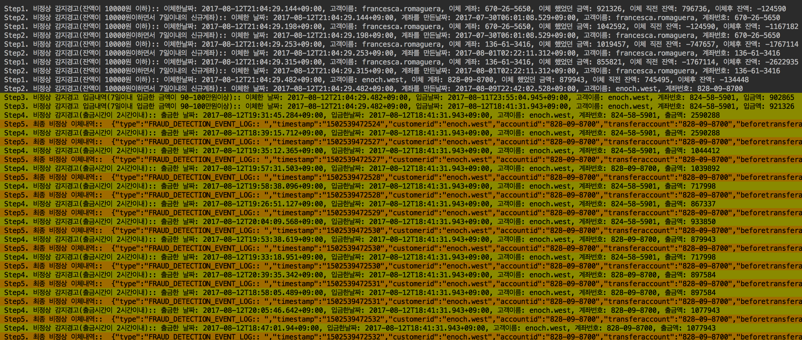

Kafka Work.
===

>work
>1) Banking system -> generate log file.
>2) parsing log file and generate event -> kafka publish to 'bank.events' topic
>3) build kafka topology -> source, storeProcess, ruleProcess, sink
     

#command

zookeeper start
---
    1.zookeeper-server-start /usr/local/Cellar/kafka/0.11.0.0/libexec/config/zookeeper.properties
    
kafka server start
---
    2.kafka-server-start /usr/local/Cellar/kafka/0.11.0.0/libexec/config/server.properties
    
kafka consumer1 start
---
    3.kafka-console-consumer --bootstrap-server localhost:9092 \
    --topic fds.detections \
    --from-beginning \
    --property print.key=true \
    --property print.value=true \
    --property key.deserializer=org.apache.kafka.common.serialization.StringDeserializer \
    --property value.deserializer=org.apache.kafka.common.serialization.StringDeserializer
    
kafka consumer2 start
---
    4.kafka-console-consumer --bootstrap-server localhost:9092 \
        --topic bank.events \
        --from-beginning \
        --property print.key=true \
        --property print.value=true \
        --property key.deserializer=org.apache.kafka.common.serialization.StringDeserializer \
        --property value.deserializer=org.apache.kafka.common.serialization.StringDeserializer
        
        
result
---
